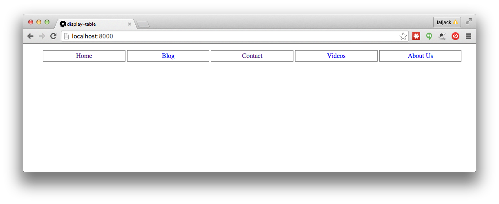
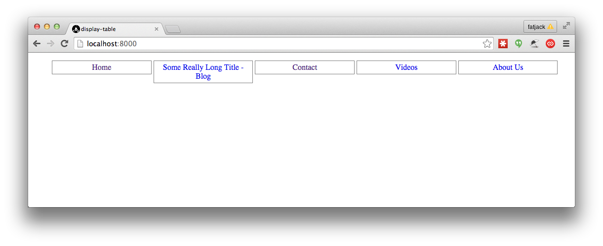
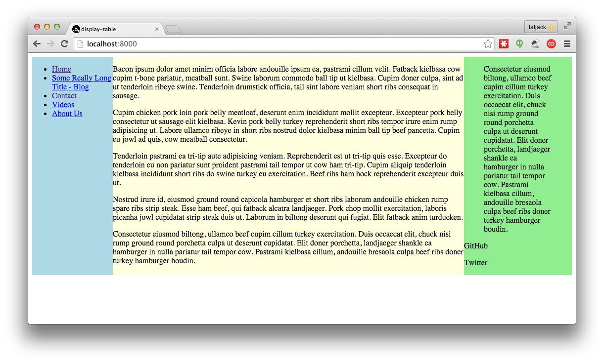
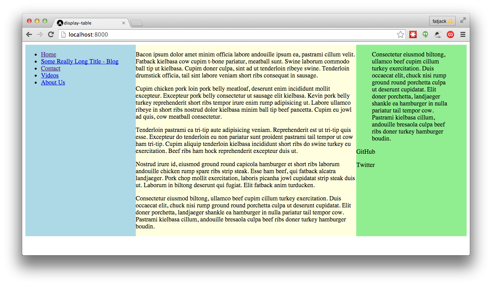

# My Lineman Application

## inline block

start with inline-block-start branch and try to make the navigation look like:

## vertical align

start with vertical-align-start branch and account for the long blog title

## display table

start with table-start branch and make three column layout with display table

## flex box

start with flex-start branch and convert the display table layout to flex box

